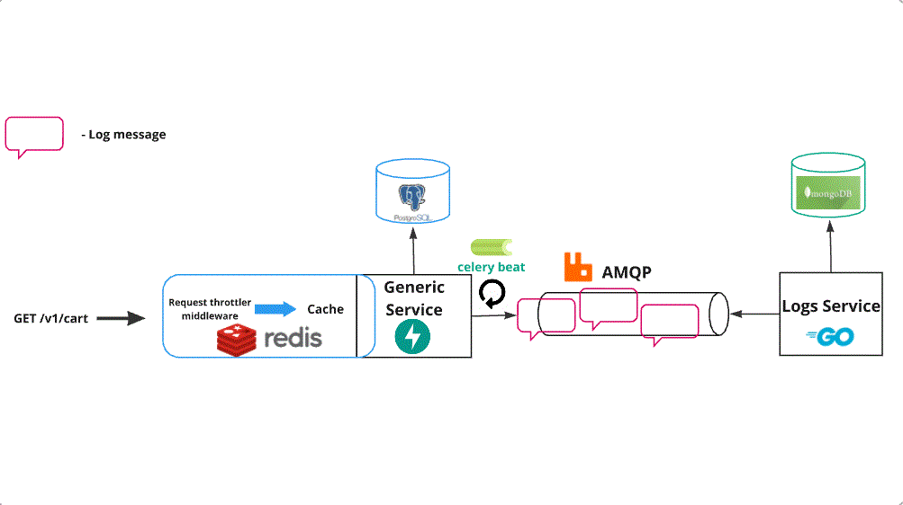
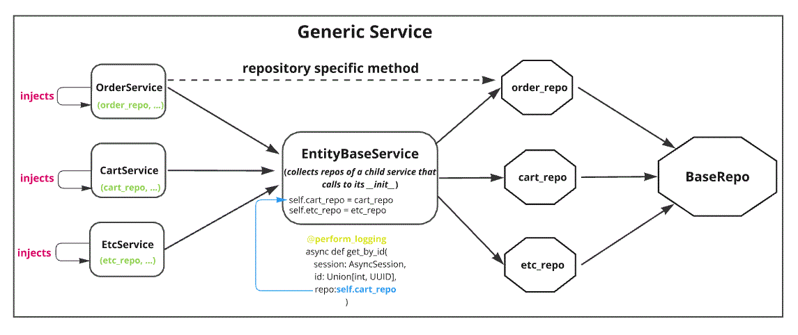

# About the project

## Flow:


### *Project hasn't been fully tested yet and has bugs*

## This is ecommerce book shop API

## Features of the project
### 1. Books management:  create, edit, delete, get, get books by filters

### 2. User management and permissions: register, login, authentication via JWT tokens, permissions for different types of actions (such as permissions for performing actions on order / cart)

### 3. Shopping cart: CRUD for cart, implemented caching and update of cart items right in the cache using Redis set and Redis hash data structures

### 4. Order management: create and manage orders, update orders, add / delete books from orders

### 5. Created 2 implementations for storing pictures of books. You can use Object storage (I integrated with *Cloud.ru* to get access to free s3 buckets) or store pictures in the project folder. I used PIL to manage picture dimensions in conjunction with Celery for creating file structure for storing images

### 6. Search and filtering: Created module that allows to create flexible filters (you can filter by related fields) on the basis of Pydantic models and Sqlalchemy filter mappers

### 7. Services interaction: used RabbitMQ to perform inter-service interaction. In the Generic Service there is a Celery scheduled task that parses logs file, constructs a message and pushes it to RabbitMQ exchange. Logs service consumes messages and saves them to MongoDB


### 8. Payment Gateway Integration: integrated with YooKassa payment service in test mode and implemented logic for making payments and refunds


### 9. Implemented request limiter using Redis by creating middleware

### 10. Used Celery beat to clear expired carts from the database

### 11. Created integration and api tests 

### In the Logs Service I didn't use any specific libraries. It's a simple REST service built with Go standard library that is accessible by a couple of endpoints (get logs and store logs) and also acts as a consumer

## Modules architecture overview



#### In the picture you can see 2 ways of 1-directional interaction between modules. For implementing service to repository interaction, I used repository pattern. Each service may call directly to the injected repository to use one of its methods, or it can use EntityBaseService that also propagates request to the specific repository but also does exception handling and logging for exceptions raised in the repository layer. EntityBaseService is a generic class that works with multiple classes that implement methods defined in EntityBaseService. It helps to cut down code by moving repeated exception-handling and logging logic from each service to EntityBaseService. It catches storage exceptions, loggs them and returns http-level exceptions.

### Languages and tech used: Python 3.10, Go 1.22.0, FastAPI, SqlAlchemy 2.0, Pydantic, Alembic, AioRedis, PIL, Python-json-logger, Pytest, Celery, PIL, RabbitMQ, Postgres, MongoDB

# How to use the project
### 1. git clone github.com/kirilldarealcaucasian/book_shop
### 2. This is common application config. Put this in .env file. Put .env file in ecommerce/core/config folder
```yaml
MODE=TEST
LOG_LEVEL=INFO
LOGS_JOURNAL_NAME=logs_journal.json
DB_USER=postgres
DB_PASSWORD=postgres
DB_SERVER=localhost
DB_PORT=5432
DB_NAME=proj_db
TEST_POSTGRES_USER=postgres
TEST_POSTGRES_PASSWORD=postgres
TEST_POSTGRES_SERVER=db
TEST_POSTGRES_PORT=5432
TEST_POSTGRES_DB=proj_db_test
REDIS_HOST=localhost
REDIS_PORT=6379
RABBIT_USER=rmuser
RABBIT_PASSWORD=rmpassword
RABBIT_HOST=rabbitmq
RABBIT_PORT=5672
SHOPPING_SESSION_DURATION=1:0:0
SHOPPING_SESSION_COOKIE_NAME=shopping_session_id
YOOCASSA_ACCOUNT_ID=your_account_id
YOOCASSA_SECRET_KEY=your_secret_key
```
### 3. This config is needed to integrate with Cloud.ru object storage service. Put this in .env file. Put .env file in ecommerce/application/services/storage/s3_storage folder. 
```yaml 
SERVICE_NAME=s3
ENDPOINT_URL=https://s3.cloud.ru/images-bucket
BUCKET_NAME=images-bucket
REGION_NAME=ru-central-1
TENANT_ID=your_tenant_id
KEY_ID=your_kay_id
SECRET_KEY=your_sercret_ket
```
### 4. cd project

### 5. docker-compose up --build

### 6. when everything is set up, you can run pytest tests

#### (project might not work successfully for the first time of launch, so you need to stop containers and do: docker-compose up, because there is a bug I haven't fixed yet)


